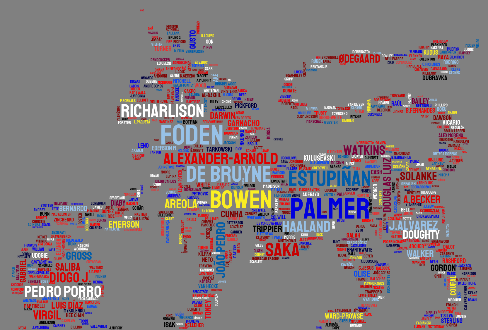

# premCloudBot

## Overview

premCloudBot is a bot deployed on AWS Lambda that generates and posts a word cloud every Friday at 18:44 UTC. The word cloud visualizes the most transferred-in Premier League players in the latest Fantasy Premier League week. The data for the word cloud is extracted from the FPL API endpoints.

## Example:

## Twitter (X)

You can find the bot's posts on Twitter (X) at [PremCloudBot](https://twitter.com/PremCloudBot).
